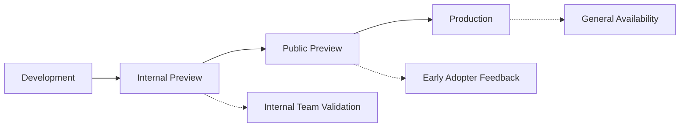

# Deployment Guide

Complete guide for deploying the Azure DevOps PR Reviewer extension through all environments.

## 📋 Table of Contents
- [Overview](#overview)
- [Environments](#environments)
- [Prerequisites](#prerequisites)
- [Automated Deployment](#automated-deployment)
- [Manual Deployment](#manual-deployment)
- [Rollback Procedures](#rollback-procedures)
- [Troubleshooting](#troubleshooting)

## Overview

The extension follows a three-stage deployment pipeline that aligns with the PRD rollout plan:



Each environment serves a specific purpose in the validation and rollout process.

## Environments

### 1. Internal Preview
- **Purpose**: Internal team validation on sample projects
- **Trigger**: Push to `develop` branch
- **Distribution**: Internal extension registry
- **Audience**: Development team and selected internal users
- **Validation**: Functional testing with real Azure DevOps projects

### 2. Public Preview
- **Purpose**: Early adopter feedback and broader validation
- **Trigger**: Push to `release/*` branches
- **Distribution**: VS Code Marketplace with preview flag
- **Audience**: Early adopters and beta users
- **Validation**: Community feedback and usage analytics

### 3. Production
- **Purpose**: General availability for all users
- **Trigger**: Push to `main` branch or manual release
- **Distribution**: VS Code Marketplace
- **Audience**: All VS Code users
- **Validation**: Full monitoring and support infrastructure

## Prerequisites

### Development Environment
```bash
# Required tools
node -v          # v18.x or higher
npm -v           # v9.x or higher
code --version   # VS Code for testing

# Extension packaging tool
npm install -g @vscode/vsce

# Optional: Playwright for E2E tests
npm install -g playwright
```

### Access Requirements
- GitHub repository with push access
- VS Code Marketplace publisher account
- Azure DevOps organization for testing
- Access to internal extension registry (for internal previews)

### Environment Variables
```bash
# Required for all environments
VSCE_PAT=<marketplace-personal-access-token>

# Required for production
EXTENSION_SIGNING_CERT=<base64-encoded-certificate>
CERT_PASSWORD=<certificate-password>

# Required for internal previews
INTERNAL_REGISTRY_URL=<internal-registry-endpoint>
INTERNAL_REGISTRY_TOKEN=<internal-access-token>

# Optional: Notifications
SLACK_WEBHOOK_URL=<slack-webhook-for-notifications>
MONITORING_WEBHOOK_URL=<monitoring-system-webhook>
```

## Automated Deployment

### GitHub Actions Pipeline

The primary deployment mechanism uses GitHub Actions with environment-specific workflows:

#### 1. Continuous Integration (`ci.yml`)
Runs on every push and pull request:
```yaml
# Triggers
- push: [main, develop, release/*]
- pull_request: [main, develop]

# Jobs
- quality      # Lint, type check, format
- test         # Unit and integration tests
- e2e          # End-to-end browser tests
- security     # Security scans and audits
- package      # Extension packaging
- deploy-*     # Environment-specific deployment
```

#### 2. Release Pipeline (`release.yml`)
Handles production releases and manual deployments:
```yaml
# Triggers
- push: tags/v*.*.*
- workflow_dispatch

# Jobs
- prepare      # Determine deployment parameters
- build        # Build and package extension
- security     # Additional security validation
- deploy-*     # Multi-environment deployment
- monitor      # Post-deployment monitoring
```

### Deployment Commands

#### Automated Deployment (Recommended)
```bash
# Internal Preview: Push to develop
git checkout develop
git push origin develop

# Public Preview: Create release branch
git checkout -b release/1.2.0
git push origin release/1.2.0

# Production: Push to main or create tag
git checkout main
git push origin main
# OR
git tag v1.2.0
git push origin v1.2.0
```

#### Manual Deployment via GitHub Actions
```bash
# Using GitHub CLI
gh workflow run release.yml \
  -f environment=preview \
  -f version=1.2.0

# Or via GitHub web interface
# https://github.com/{owner}/{repo}/actions/workflows/release.yml
```

## Manual Deployment

For emergency deployments or when automation is unavailable:

### 1. Package Extension
```bash
# Clean and install dependencies
npm ci

# Set environment
export NODE_ENV=production

# Package extension
node scripts/package.js
```

### 2. Deploy to Internal Registry
```bash
# Set environment variables
export DEPLOY_ENV=internal
export INTERNAL_REGISTRY_URL=<url>
export INTERNAL_REGISTRY_TOKEN=<token>

# Deploy
node scripts/deploy.js
```

### 3. Deploy to VS Code Marketplace
```bash
# Set environment variables
export DEPLOY_ENV=production  # or preview
export VSCE_PAT=<marketplace-token>

# For preview releases
npx vsce publish --pre-release --packagePath ./dist/*.vsix

# For production releases
npx vsce publish --packagePath ./dist/*.vsix
```

### 4. Verify Deployment
```bash
# Check marketplace listing
curl -f "https://marketplace.visualstudio.com/items?itemName=company.ado-pr-reviewer"

# Test extension installation
code --install-extension company.ado-pr-reviewer

# Run health checks
npm run health-check
```

## Rollback Procedures

### Automated Rollback
GitHub Actions workflow automatically triggers rollback on production deployment failures:

```bash
# Automatic rollback triggers
- Deployment failure in production
- Critical health check failures
- High error rates detected

# Manual rollback trigger
gh workflow run deploy-rollback.yml \
  -f version=<previous-version> \
  -f reason="Critical bug found in v1.2.1"
```

### Manual Rollback Steps

#### 1. Identify Previous Version
```bash
# Find last successful release
gh api /repos/{owner}/{repo}/releases \
  --jq '.[] | select(.prerelease == false) | .tag_name' \
  | head -n2 | tail -n1
```

#### 2. Rollback Marketplace Release
```bash
# Download previous version
gh release download v1.1.0 --pattern "*.vsix"

# Republish previous version
npx vsce publish --packagePath ./ado-pr-reviewer-1.1.0.vsix
```

#### 3. Update Documentation
```bash
# Create rollback announcement
gh issue create \
  --title "🔄 Rollback: v1.2.1 → v1.1.0" \
  --body "Emergency rollback due to critical issue..."
```

#### 4. Monitor Rollback
```bash
# Trigger health checks
gh workflow run health-check.yml \
  -f environment=production \
  -f version=1.1.0
```

### Rollback Verification
- Extension appears correctly in marketplace
- Download and installation work properly
- No critical errors in telemetry
- User feedback indicates issues resolved

## Deployment Validation

### Pre-Deployment Checks
```bash
# Automated in CI/CD pipeline
✅ All tests pass
✅ Security scans clear
✅ Package builds successfully
✅ Dependencies up to date
✅ Documentation updated

# Manual verification for production
✅ Change log updated
✅ Breaking changes documented
✅ Performance benchmarks acceptable
✅ Stakeholder approval obtained
```

### Post-Deployment Verification
```bash
# Immediate (< 5 minutes)
✅ Extension appears in marketplace
✅ Download functionality works
✅ Basic installation succeeds
✅ Health endpoints respond

# Short-term (< 1 hour)
✅ No error spikes in telemetry
✅ User installations beginning
✅ No critical issues reported
✅ Performance within normal ranges

# Medium-term (< 24 hours)
✅ Installation growth normal
✅ Error rates below thresholds
✅ User feedback positive
✅ All features functioning
```

## Deployment Scheduling

### Recommended Deployment Windows
- **Internal Preview**: Any time (development team available)
- **Public Preview**: Tuesday-Thursday 9AM-3PM PT (optimal for feedback)
- **Production**: Tuesday-Wednesday 8AM-12PM PT (allows issue resolution)

### Avoid Deployment During
- Fridays and weekends (limited support availability)
- Major holidays and company events
- Microsoft/VS Code major releases (marketplace congestion)
- Known Azure DevOps maintenance windows

## Configuration Management

### Environment-Specific Configuration
```json
{
  "internal": {
    "telemetry": {"aiKey": "internal-key", "level": "verbose"},
    "features": {"experimental": true, "debug": true},
    "api": {"timeout": 10000, "retries": 5}
  },
  "preview": {
    "telemetry": {"aiKey": "preview-key", "level": "standard"},
    "features": {"experimental": true, "debug": false},
    "api": {"timeout": 5000, "retries": 3}
  },
  "production": {
    "telemetry": {"aiKey": "prod-key", "level": "standard"},
    "features": {"experimental": false, "debug": false},
    "api": {"timeout": 5000, "retries": 3}
  }
}
```

### Feature Flags
```typescript
// Environment-based feature toggling
const features = {
  experimentalUI: process.env.NODE_ENV !== 'production',
  advancedMetrics: process.env.DEPLOY_ENV !== 'internal',
  debugLogging: process.env.NODE_ENV === 'development'
};
```

## Monitoring Deployment

### Key Metrics to Monitor
- **Deployment Success Rate**: Target 95%+
- **Rollback Rate**: Target <5%
- **Deployment Duration**: Target <30 minutes
- **Time to Recovery**: Target <4 hours

### Alerting Thresholds
- **Critical**: Deployment failure, security vulnerability
- **Warning**: Performance degradation, high error rate
- **Info**: Successful deployment, milestone reached

### Dashboard URLs
- **CI/CD Pipeline**: `https://github.com/{repo}/actions`
- **Marketplace Analytics**: VS Code Marketplace publisher portal
- **Telemetry Dashboard**: Application Insights dashboard
- **Health Monitoring**: Custom monitoring dashboard

## Troubleshooting

### Common Deployment Issues

#### 1. Package Build Failures
```bash
# Check TypeScript compilation
npm run compile

# Verify dependencies
npm audit
npm outdated

# Clean rebuild
npm run clean
npm ci
npm run build
```

#### 2. Marketplace Publishing Errors
```bash
# Verify PAT permissions
npx vsce ls-publishers

# Check package contents
npx vsce show package.vsix

# Validate manifest
npx vsce package --no-yarn --dry-run
```

#### 3. Extension Signing Issues
```bash
# Verify certificate
openssl pkcs12 -info -in cert.p12 -noout

# Check certificate expiration
npx @vscode/vsce verify-pat <pat-token>

# Test signing process
npx @vscode/vsce sign --cert cert.p12 --password <pwd> package.vsix
```

#### 4. Health Check Failures
```bash
# Manual health verification
curl -f https://marketplace.visualstudio.com/items?itemName=company.ado-pr-reviewer

# Test extension installation
code --install-extension company.ado-pr-reviewer --force

# Check extension activation
code --list-extensions --show-versions | grep ado-pr-reviewer
```

### Emergency Procedures

#### Critical Production Issue
1. **Immediate Response** (0-15 minutes)
   - Acknowledge alert and assess impact
   - Determine if rollback is necessary
   - Notify stakeholders of issue

2. **Investigation** (15-60 minutes)
   - Use monitoring dashboard to identify root cause
   - Check recent changes and deployments
   - Reproduce issue in lower environments

3. **Resolution** (60-240 minutes)
   - Deploy hotfix if available
   - Otherwise, rollback to previous version
   - Verify resolution and monitor metrics

4. **Post-Incident** (1-7 days)
   - Conduct post-mortem analysis
   - Update documentation and procedures
   - Implement preventive measures

### Support Contacts

- **Primary Oncall**: Development team rotation
- **Escalation**: Engineering manager
- **Marketplace Issues**: VS Code Marketplace support
- **Infrastructure**: Platform engineering team

---

For specific runbook procedures, see the [runbooks directory](./runbooks/).